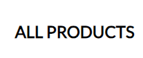
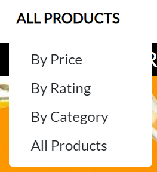
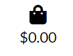

# Features

## Access to pages according to the user role:

| Page Name                      | Logged out | Customers | Manager | Admin                 |
| ------------------------------ | ---------- | --------- | ------- | --------------------- |
| Home                           | Yes        | Yes       | Yes     | Yes                   |
| Login                          | Yes        | Yes       | Yes     | Yes                   |
| Register                       | Yes        | Yes       | Yes     | Yes                   |
| Logout                         | Yes        | Yes       | Yes     | Yes                   |
| Store Products                 | Yes        | Yes       | Yes     | Yes                   |
| Store Product's Details        | Yes        | Yes       | Yes     | Yes                   |
| All reviews                    | Yes        | Yes       | Yes     | Yes                   |
| Bag                            | No         | Yes       | Yes     | Yes                   |
| My Orders                      | No         | Yes       | Yes     | Yes                   |
| My Order's Details             | No         | Yes       | Yes     | Yes                   |
| My Wishlist                    | No         | Yes       | Yes     | Yes                   |
| Checkout                       | No         | Yes       | Yes     | Yes                   |
| Create newsletter              | No         | No        | Yes     | Yes                   |
| Categories                     | No         | No        | Yes     | Yes                   |
| Add category                   | No         | No        | Yes     | Yes                   |
| Edit category                  | No         | No        | Yes     | Yes                   |
| Delete category                | No         | No        | No      | Yes                   |
| Tags                           | No         | No        | Yes     | Yes                   |
| Add tag                        | No         | No        | Yes     | Yes                   |
| Edit tag                       | No         | No        | Yes     | Yes                   |
| Delete tag                     | No         | No        | Yes     | Yes                   |
| Products' Types                | No         | No        | Yes     | Yes                   |
| Add product's type             | No         | No        | Yes     | Yes                   |
| Edit product's type            | No         | No        | Yes     | Yes                   |
| Delete product's type          | No         | No        | No      | Yes                   |
| Products' attributes           | No         | No        | Yes     | Yes                   |
| Add product's attribute        | No         | No        | Yes     | Yes                   |
| Edit product's attribute       | No         | No        | Yes     | Yes                   |
| Delete product's attribute     | No         | No        | No      | Yes                   |
| Product's values               | No         | No        | Yes     | Yes                   |
| Add product's value            | No         | No        | Yes     | Yes                   |
| Edit product's value           | No         | No        | Yes     | Yes                   |
| Delete product's value         | No         | No        | No      | Yes                   |
| Personnel Products Table       | No         | No        | Yes     | Yes                   |
| Add product                    | No         | No        | Yes     | Yes                   |
| Edit product                   | No         | No        | Yes     | Yes                   |
| Delete product                 | No         | No        | Yes     | Yes                   |
| Add new image modal            | No         | No        | Yes     | Yes                   |
| Edit image modal               | No         | No        | Yes     | Yes                   |
| Delete image modal             | No         | No        | Yes     | Yes                   |
| Add product's unit             | No         | No        | Yes     | Yes                   |
| Edit product's unit            | No         | No        | Yes     | Yes                   |
| Delete product's unit          | No         | No        | Yes     | Yes                   |
| Product's units                | No         | No        | Yes     | Yes                   |
| Product's unit's details       | No         | No        | Yes     | Yes                   |
| Orders                         | No         | No        | Yes     | Yes                   |
| Order's details                | No         | No        | Yes     | Yes                   |
| Edit order status feature      | No         | No        | No      | Yes + Logistics manager   |
| Edit Order                     | No         | No        | No      | Yes                   |
| Delete order                   | No         | No        | No      | Yes                   |
| Edit order's item              | No         | No        | No      | Yes                   |
| Delete order's item            | No         | No        | No      | Yes                   |

## Main Features:

- Each page has a navbar and a footer beside account's pages.

### Navbar:

- The Navbar has:
    - logo, which redirects to the home page;
    

    - All products, a list appears to arrange the display of products on the site according to what the user chooses;
    
    

    - Raw honey, which redirects to the raw honey page;
    
    

    - Pure honey, which redirects to the pure honey page;
    
    

    - Special Offers honey, which redirects to the special offers page;
    
    

    - Wish List, which redirects to the wish list page;
    
    - If the user not logged in it will redirects him to sign in page;
    
    - If the user is already logged in it will redirects him to wishlist page;
    

    - My Account, which redirects to the register or log in page;
    
    

    - Shopping Bag, which redirects to the shopping bag;
    
    

    - Search Field, let the user search for specific products;
    

### Home page:

Home page has:

- Delivery Banner:
  

- Hero Section:
  

- Shop Now Button, which redirects to the products page:
  
  

### Footer:

Footer has the following features:

- Newletter Subscription, which redirects to the newsletter page;

- After submitting the newsletter subscription, the user will be directed to success page;

- If the user already subscribed, a message will shows up for the user;
