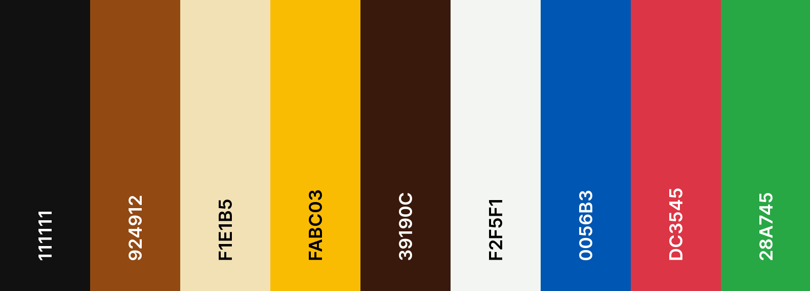

# Honeyshop website

**Deployed website: [Link to website](https://honeyshop-58be54febc57.herokuapp.com/)**

**Card number for payment testing: 4242424242424242**

## About

"Honeyshop" is an e-commerce website that allows customers to buy various honey products. It has a login system, a shopping cart, a checkout system, and a payment system.
In addition, the website has a newsletter subscription.

---

## UX

The website was created to be eye-catching and user-friendly. The user is given plenty of choices to choose from when they are shopping. The emphasis is on the user experience; the user can navigate the website easily to fulfill users' goals. The website is designed to be easy to use and easy to understand. Additionally,It also handles all personnel functionality moving from admin to manager to other personnel.
Business goals were to make the website as scalable as possible and reusable in the real world so that the store personnel could use it according to their position in the company.

### Target Audience

Our e-commerce honey shop targets individuals who:

- **Income Level:** Middle-income earners.
- **Target groups:** All segments of society.

#### Psychographic Characteristics:

- **Interests and Hobbies:** Health-conscious individuals interested in natural products and culinary exploration.
- **Values and Beliefs:** Value sustainability, authenticity, and transparency in food sourcing.
- **Online Behavior:** Active online shoppers who seek convenience and value informative content.
- **Shopping Preferences:** Prefer high-quality, ethically sourced honey products with an emphasis on health benefits and unique flavors.

#### Needs and Pain Points:

- Seek natural and sustainable honey options for health and culinary purposes.
- Desire transparent sourcing and production information.
- Value user-friendly online shopping experiences with secure payment options.

### User Stories

#### First Time Visitor

| User Story ID | Description                                                                                                 |
|---------------|-------------------------------------------------------------------------------------------------------------|
| 1             | Easily understand the purpose and offerings of the honey shop.                                             |
| 2             | Expect a visually appealing and intuitive interface for navigation.                                         |
| 3             | Seek clear and concise information about the types of honey available and their benefits.                   |
| 4             | Require guidance on how to create an account for making purchases.                                           |
| 5             | Expect a straightforward process to browse products and add them to the cart.                                |
| 6             | Want to feel confident about the security of personal information during registration.                       |
| 7             | Find information about shipping policies and delivery times for my location.                                 |
| 8             | Need clear instructions on how to proceed with the checkout process.                                         |
| 9             | Appreciate options for contacting customer support or accessing FAQs for assistance.                         |
| 10            | Easily find links to the shop's social media profiles or newsletter subscription for updates and promotions. |

#### Regular User (Customer)

| User Story ID | Description                                                                                                   |
|---------------|---------------------------------------------------------------------------------------------------------------|
| 1             | Easily log in to my account.                    |
| 2             | Expect personalized recommendations based on past purchases and browsing history.                            |
| 3             | Want to easily browse and filter products by category, price, and other relevant criteria.                    |
| 4             | Desire the option to save favorite products to my wishlist for future purchase consideration.                 |
| 5             | Appreciate seamless access to customer support for order inquiries, returns, or assistance with products.     |
| 6             | Need to update account information, including shipping address and payment details, easily and securely.      |
| 7             | Expect timely notifications about order status, shipment tracking, and delivery updates.                      |
| 8             | Want the option to leave reviews and ratings for products I've purchased to help other customers make decisions.|
| 9             | Appreciate exclusive offers, discounts, or rewards for being a loyal customer.                                |
| 10            | Prefer a user-friendly interface with clear navigation and intuitive layout for a smooth shopping experience.  |

| User Story ID | Description                                                                                                   |
|---------------|---------------------------------------------------------------------------------------------------------------|
| 1             | Access and manage product inventory, including adding, editing, and removing products.                       |
| 2             | Monitor and analyze sales data, including revenue, product performance, and customer trends.                  |
| 3             | Manage user accounts and permissions, including creating, modifying, and deleting user profiles.             |
| 4             | View and respond to customer inquiries, feedback, and support tickets efficiently.                            |
| 5             | Generate and export reports on various aspects of the business, such as sales, inventory, and customer data.  |
| 6             | Set up and manage promotional campaigns, discounts, and special offers for customers.                         |
| 7             | Configure and customize website settings, including layout, themes, and content management.                   |
| 8             | Manage payment and shipping options, including configuring rates, methods, and integration with carriers.    |
| 9             | Ensure website security and compliance with data protection regulations, including implementing security measures and protocols. |
| 10            | Collaborate with team members, such as marketers, developers, and customer support, to optimize business operations and customer experience. |

## Business Model

The Business Model is B2C, meaning that the company sells products to customers only.
It focuses on individual transactions only.

### Persona Summary: Health Enthusiast

#### Goals and Motivations:
- Seeks natural, organic products that align with a health-conscious lifestyle.
- Values transparency in sourcing and production processes, prioritizing ethically produced and environmentally sustainable products.
- Enjoys exploring unique, high-quality items to recommend to followers.

#### Shopping Behavior:
- Prefers online shopping for convenience and extensive product selection.
- Enjoys exploring niche brands and artisanal products, especially those with health and wellness benefits.
- Willing to invest in premium products offering superior quality and value.

#### Pain Points:
- Limited availability of locally sourced, organic honey varieties.
- Difficulty finding detailed information about product sourcing and authenticity online.
- Concerns about environmental impact of packaging and shipping practices.

#### Needs and Preferences:
- Access to a wide range of organic honey varieties, including raw, flavored, and specialty blends.
- Transparent product information, including sourcing details, certifications, and sustainability practices.
- Convenient shipping options with eco-friendly packaging choices.
- Engaging content and educational resources related to honey benefits, recipes, and usage tips.

#### How the Store Meets Needs:
- Offers diverse selection of organic honey sourced from sustainable beekeeping practices.
- Provides detailed product descriptions, including sourcing information and certifications.
- Implements eco-friendly packaging solutions and carbon-neutral shipping options.
- Curates informative blog posts and recipe ideas tailored to interests and preferences.

## Future Development

### Expansion of Product Range
Expanding our product range is an exciting endeavor. We aim to introduce new flavors, blends, and specialty varieties to cater to diverse tastes and preferences. Through thorough market research and customer feedback, we hope to unveil emerging trends and bring innovative products to the market.

### Enhanced User Experience
Investing in an enhanced user experience is a top priority. We plan to implement user-friendly features such as advanced search functionality, personalized recommendations, and intuitive navigation. Our goal is to create a website that delights and engages our customers at every step of their journey.

### Mobile Optimization
We recognize the importance of mobile optimization in today's digital landscape. Our focus is on creating a mobile-responsive design that ensures a seamless and intuitive browsing experience across all devices. We want to make shopping on our platform effortless and enjoyable for mobile users.

### International Expansion
Expanding into international markets presents significant growth opportunities. We are eager to explore new horizons and reach a broader audience with our premium honey products. By tailoring our offerings and marketing strategies to different cultures and regions, we aim to connect with customers worldwide.

### Integration of AI Technology
Integrating AI technology into our platform holds immense potential. We envision leveraging AI-powered features such as chatbots for customer support, personalized product recommendations, and predictive analytics to enhance the shopping experience. Our goal is to deliver a more personalized and efficient service to our customers.

### Sustainability Initiatives
Our commitment to sustainability drives us to implement eco-friendly practices across our operations. We are exploring options for sustainable packaging materials, carbon-neutral shipping, and partnerships with environmentally conscious suppliers. We aim to minimize our environmental footprint and promote ethical practices throughout our supply chain.

### Community Engagement
Building a strong community around our brand is paramount. We plan to engage with local beekeeping associations, environmental organizations, and wellness communities to raise awareness and support shared causes. By fostering meaningful connections, we aim to build trust and loyalty among our customers.

### Continuous Innovation
We believe in fostering a culture of innovation and creativity within our organization. We encourage experimentation and welcome new ideas that push the boundaries of what's possible. Through cross-functional collaboration and a spirit of entrepreneurship, we strive to stay ahead of industry trends and drive meaningful change.

### Feedback and Iteration
Listening to our customers is essential to our growth strategy. We value their feedback and insights, which serve as valuable guidance for future development. By actively seeking feedback through surveys, reviews, and social media interactions, we aim to identify areas for improvement and deliver a superior experience for our customers.

### Conclusion
As we look to the future, we are excited about the possibilities that lie ahead. Our commitment to innovation, sustainability, and customer satisfaction will continue to guide us on our journey of growth and success.

---

## Technologies used
- ### Languages:
    
    + [Python 3.11.4](https://www.python.org/downloads/release/python-3114/): the primary language used to develop the server-side of the website.
    + [JS](https://www.javascript.com/): the primary language used to develop interactive components of the website.
    + [HTML](https://developer.mozilla.org/en-US/docs/Web/HTML): the markup language used to create the website.
    + [CSS](https://developer.mozilla.org/en-US/docs/Web/css): the styling language used to style the website.

- ### Frameworks and libraries:

    + [Django](https://www.djangoproject.com/): python framework used to create all the logic.
    + [jQuery](https://jquery.com/): was used to control click events and sending AJAX requests.
    + [jQuery User Interface](https://jqueryui.com/) was used to create interactive elements.

- ### Databases:

    + [SQLite](https://www.sqlite.org/): was used as a development database.
    + [PostgreSQL](https://www.postgresql.org/): the database used to store all the data.

- ### Other tools:

    + [Git](https://git-scm.com/): the version control system used to manage the code.
    + [Pip3](https://pypi.org/project/pip/): the package manager used to install the dependencies.
    + [Gunicorn](https://gunicorn.org/): the web server used to run the website.
    + [Psycopg2](https://www.psycopg.org/): the database driver used to connect to the database.
    + [Django-allauth](https://django-allauth.readthedocs.io/en/latest/): the authentication library used to create the user accounts.
    + [Django-crispy-forms](https://django-cryptography.readthedocs.io/en/latest/): was used to control the rendering behavior of Django forms.
    + [GitHub](https://github.com/): used to host the website's source code.
    + [VSCode](https://code.visualstudio.com/): the IDE used to develop the website.
    + [Chrome DevTools](https://developer.chrome.com/docs/devtools/open/): was used to debug the website.
    + [Font Awesome](https://fontawesome.com/): was used to create the icons used in the website.
    + [W3C Validator](https://validator.w3.org/): was used to validate HTML5 code for the website.
    + [W3C CSS validator](https://jigsaw.w3.org/css-validator/): was used to validate CSS code for the website.
    + [Flumer](https://fulmerhoney.com/index.php?route=common/home) was used to get the products images.
    + [Unsplash](https://unsplash.com/) was used to get the homepage background image.
    + [JShint](https://jshint.com/): was used to validate JS code for the website.
    + [PEP8](https://pep8.org/): was used to validate Python code for the website.
    + [stripe](https://stripe.com/): was used to create the payment system.
    + [Sitemap Generator](https://www.xml-sitemaps.com/) was used to create the sitemap.xml file.
    + [Django-extensions](https://django-extensions.readthedocs.io/en/latest/) was used to create a Entity-Relationship Diagram.

---

## Features

Please refer to the [FEATURES.md](FEATURES.md) file for all test-related documentation.

---

## Design

The design philosophy of our e-commerce honey shop is rooted in simplicity and user-centricity. Inspired by modern design principles, we have embraced a minimalist approach to ensure a seamless and intuitive experience for our users.

Drawing from the principles of Material Design, we have carefully selected colors that resonate with our brand identity while remaining consistent with industry standards. These colors not only enhance visual appeal but also contribute to a cohesive and harmonious user interface.

In our pursuit of providing a comprehensive customer experience and efficient business management, we have embraced the use of white space strategically throughout the application. By incorporating ample white space, we aim to declutter the interface and prioritize essential content, thereby facilitating better user focus and engagement.

Our commitment to user-centric design extends beyond aesthetics; it is a reflection of our dedication to crafting meaningful interactions and fostering a delightful user experience at every touchpoint.

### Color Scheme

Our e-commerce honey shop adopts a carefully curated color scheme that balances both vibrancy and tranquility. The combination of bold and neutral colors creates an inviting and harmonious user experience.

- **Bold Colors:** Vibrant hues are strategically incorporated to capture attention and add energy to the interface. These bold colors evoke a sense of excitement and playfulness, drawing users into the browsing and shopping experience.

- **Neutral Colors:** Complementing the bold palette, neutral tones are employed to instill a sense of calmness and sophistication. These understated colors provide a backdrop of serenity, allowing users to navigate the website with ease and focus on the richness of our honey offerings.

The harmonious interplay between bold and neutral colors reflects our commitment to creating an engaging and visually appealing environment for our customers to explore and enjoy the world of honey.

