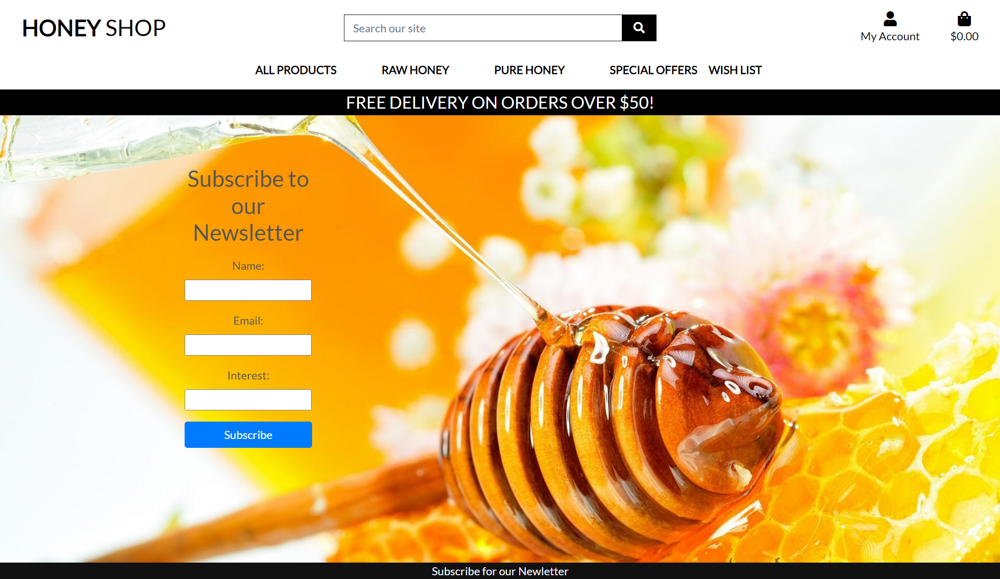

# Main Testing Focus

Each page's functionality and behavior were tested under different user roles. Here are the main areas of focus:

## Navbar:

The Navbar features were thoroughly tested to ensure functionality and usability:

- Logo navigation was tested to redirect users to the home page.
- Navigation links to different pages were checked to ensure proper redirection.
- Sort selector functionality on product pages was tested.
- Search functionality was tested for accurate product search results.

## Home Page:

- Delivery Banner and Hero Section functionality were tested for proper display.
- Shop Now button functionality was verified to redirect users to the products page.

## Footer:

- Newletter Subscription feature was tested for successful subscription.
- Success and error messages were verified for the newsletter subscription process.

## Sign Up:

- User registration and sign-up process were tested for accurate data capture.
- Email verification process was validated, including confirmation email receipt and account activation.

## Sign In:

- User login functionality was tested for successful authentication.
- Error handling for incorrect login credentials was verified.

## Wishlist:

- Adding and removing products from the wishlist were tested for accurate functionality.
- Success and error messages were validated for wishlist actions.

## Shopping Bag:

- Adding products to the shopping bag and updating quantities were tested.
- Checkout process was tested for accuracy, including order summary display and order placement.

## Product Management:

- Adding, editing, and deleting products and product attributes were tested.
- Image upload functionality for products was validated.

## Category and Tag Management:

- Adding, editing, and deleting categories and tags were tested.
- Assigning categories and tags to products were validated.

## Personnel Management:

- Product units management functionalities were tested.
- Personnel access to product and order management pages was verified.

## Error Handling:

- Error messages and validation checks were tested throughout the application.
- Proper error handling and user feedback mechanisms were validated.

## User Experience:

- Overall user experience and interface responsiveness were tested across different devices and screen sizes.
- Application performance and loading times were evaluated for optimal user experience.

The testing process ensured that all features and functionalities of the e-commerce platform operate smoothly and accurately under various user roles and scenarios.

---

## Validation

### HTML Validation:
- I have had errors during testing when passing through the official [W3C](https://validator.w3.org/) validator, but due to lack of time i was not able to fix them.
i'm gonna work on them later on.

- [Bag app HTML validation report](documentation/bag-erros.png)

- [Checkout app HTML validation report](documentation/checkout-errors.png)

- [Home app HTML validation report](documentation/home-errors.png)

- [Wishlist app HTML validation report](documentation/wishlist-errors.png)

### CSS Validation:

- [Full CSS Validation Report](documentation/css-validator.png)

- No errors or warnings were found when passing through the official [W3C (Jigsaw)](https://jigsaw.w3.org/css-validator/#validate_by_uri) validator except for the warnings about the use of css root variables and webkits for the box-shadow. However, css code works perfectly on various devices.

### JS Validation:

- [Full JS Validation Report](documentation//js-validator.png)

- Three warning messages were found when passing through the official [JSHint](https://www.jshint.com/) validator. However, to validate js full `/* jshint esversion: 8, jquery: true, scripturl: true */` was added to the top of the file.

### Python Validation:

- Some errors were found when the code was passed through Valentin Bryukhanov's [CI Python Linter](https://pep8ci.herokuapp.com/).
- The most common error is that the line is too long.

---
## Lighthouse Report

LightHouse is a web performance testing tool that can be used to evaluate the performance of a website. The report is generated by Google Chrome.

[Lighthouse Home](documentation/lighthouse-home.png)
[Lighthouse Products](documentation/lighthouse-products.png)
[Lighthouse Bag](documentation/lighthouse-bag.png)

---

## Responsiveness

The responsiveness was checked manually by using devtools (Chrome) throughout the whole development. It was also checked with [Responsive Viewer](https://chrome.google.com/webstore/detail/responsive-viewer/inmopeiepgfljkpkidclfgbgbmfcennb/related?hl=en) Chrome extension.

---

## Deployment and Payment setup

- The app was deployed to [Heroku](https://www.heroku.com/).
- The database was deployed to [ElephantSQL](https://www.elephantsql.com/).

- The app can be reached by the [link](https://honeyshop-58be54febc57.herokuapp.com/).
---

